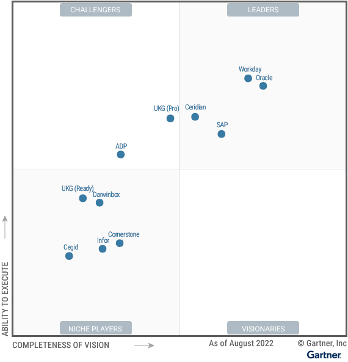

**Workday**

***Workday is a Leader in this Magic Quadrant.***
Workday is a global technology provider with annual revenue of $5.1 billion. It offers Workday Human Capital Management Suite alongside other products for ERP functions such as planning, finance, procurement, student information and professional service automation.

Workday HCM is sold to midsize and large enterprises, and has more than 4,100 customers worldwide. Approximately 71% have more than 1,000 employees, and roughly 9% have over 25,000.

Workday HCM is available hosted in a public cloud managed by Workday or in a public cloud managed by AWS (the latter is a recent approach and currently represents only a small percentage of customers). Workday supports REST and SOAP API technology, with GraphQL API technology expected to be supported in 2023.

A third-party implementation partner performs approximately 80% of Workday HCM deployments.

Workday Government Cloud (WGC) is FedRAMP-certified with a Moderate impact level.

***Strengths***

****Technology:**** Despite recent and continued acquisitions, the technology stack of Workday delivers robust integration with its multiple parts. Furthermore, the “Workday Everywhere” capability delivers the option for employees and managers to interact with Workday via Microsoft Teams, Slack and Google Chrome.

****Talent analytics and AI:**** Gartner found Workday was the highest-performing vendor for reporting, analytics and AI. High points for Workday’s reporting include the ability to analyze how attrition impacts DEI, and where potential problems could occur in locations and roles via Workday People Analytics.

****Employee experience:**** Gartner found Workday was the best-performing vendor for this capability. Differentiating features include Value Inclusion Belonging and Equity (VIBE) Index and voice of the employee sentiment analysis delivered via Workday Peakon Employee Voice.

***Cautions***

****Payroll localization:**** Workday currently offers payroll localized for use in the U.S., Canada, U.K., and France, which is the least of the four vendors in the Leaders quadrant of this research. However, Workday has announced plans to expand localization to include Germany and Australia, and integrates with third-party payroll providers in over 130 countries.

****Benefits administration:**** Workday does not deliver outsourcing services as part of benefits administration, leading clients to engage third-party service providers for such services. Furthermore, Gartner has observed less evidence of investment in benefits administration when compared with other leading vendors.

****Total operating cost and value:**** Workday remains one of the most expensive options in the market for cloud HCM suites. Furthermore, to unlock certain value such as reporting, analytics, workforce planning or employee experience, additional modules must be purchased. This makes Workday an expensive option, one that not everyone will want to pay for.
